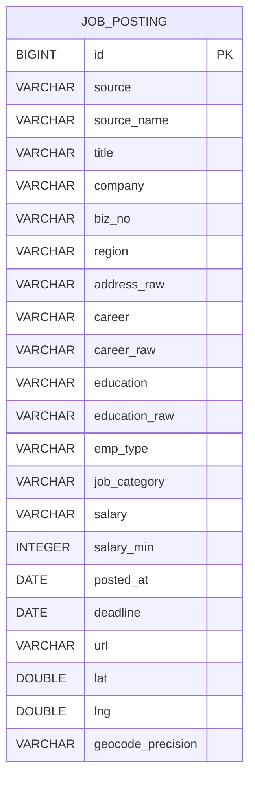

# 데이터 모델 설계

이 문서는 현재 구현된 DB 구조를 기준으로 작성한다. 운영 DB는 PostgreSQL/PostGIS 컨테이너를 사용하지만, 채용공고 조회는 현재 `job_posting` 테이블의 위도·경도 컬럼을 기준으로 처리한다.

## 1. ERD 요약

## 2. 주요 테이블

### job_posting

채용공고 통합 테이블이다. 고용24와 잡코리아 원본 데이터를 정제한 결과와 관리자 화면에서 등록·수정한 공고가 모두 이 테이블에 저장된다.

| DB 컬럼 | Java 필드 | 타입 | 필수 | 설명 |
|---|---|---:|:---:|---|
| id | id | BIGINT | Y | 공고 ID. 데이터 파이프라인 또는 관리자 등록 시 부여 |
| source | source | VARCHAR(10) | Y | 출처 구분값. `public`=고용24, `private`=잡코리아 |
| source_name | sourceName | VARCHAR(20) | Y | 화면 표시용 출처명. 예: `고용24`, `잡코리아`, `관리자` |
| title | title | VARCHAR(500) | Y | 채용공고 제목 |
| company | company | VARCHAR(200) | Y | 기업/기관명 |
| biz_no | bizNo | VARCHAR(10) | N | 사업자번호. 숫자만 남기고 10자리 기준으로 정규화 |
| region | region | VARCHAR(300) | N | 표시용 근무지역. 예: `수원시 권선구`; 복수 지역은 콤마 구분 |
| address_raw | addressRaw | VARCHAR(500) | N | 좌표 생성에 사용한 근무지 주소 또는 지역명 |
| career | career | VARCHAR(10) | N | 정규화 경력값. 예: `무관`, `신입`, `경력` |
| career_raw | careerRaw | VARCHAR(50) | N | 원본 경력 표기 |
| education | education | VARCHAR(10) | N | 정규화 학력값. 예: `무관`, `고졸 이상`, `대졸 이상` |
| education_raw | educationRaw | VARCHAR(50) | N | 원본 학력 표기 |
| emp_type | empType | VARCHAR(10) | N | 정규화 고용형태. 예: `정규직`, `계약직`, `파트타임` |
| job_category | jobCategory | VARCHAR(20) | N | 통합 직종 대분류. 9개 대분류와 `기타` 사용 |
| salary | salary | VARCHAR(100) | N | 원문 임금 표기 |
| salary_min | salaryMin | INTEGER | N | 최소 연봉 환산값. 단위: 만원 |
| posted_at | postedAt | DATE | N | 공고 등록일 또는 게시일 |
| deadline | deadline | DATE | N | 마감일. `null`이면 상시채용 |
| url | url | VARCHAR(500) | N | 원문 공고 링크 |
| lat | lat | DOUBLE PRECISION | N | WGS84 위도 |
| lng | lng | DOUBLE PRECISION | N | WGS84 경도 |
| geocode_precision | geocodePrecision | VARCHAR(20) | N | 좌표 생성 정밀도. `exact`, `company_address`, `region_approx` |

## 3. 인덱스

실제 엔티티에 정의된 인덱스는 다음과 같다.

| 인덱스명 | 컬럼 | 목적 |
|---|---|---|
| idx_job_posting_coord | lat, lng | 지도 화면 영역 조회와 주변 공고 후보 조회 |
| idx_job_posting_biz_no | biz_no | 원본 데이터 정제·검증 시 사업자번호 대조 |

검색/필터는 현재 JPA 조건식으로 처리한다. 필터 대상 컬럼은 `source`, `source_name`, `career`, `education`, `emp_type`, `job_category`, `salary_min`, `title`, `company`, `region`이다.

## 4. 코드·분류 데이터 처리 방식

별도 공통코드 테이블은 운영 DB에 만들지 않았다. 공통코드와 직종분류 CSV는 데이터 정제 단계에서 `job_posting` 컬럼에 정규화된 문자열로 반영한다.

| 분류 | 저장 컬럼 | 처리 방식 |
|---|---|---|
| 출처 | source, source_name | 원본 출처를 `public/private`와 표시명으로 분리 |
| 경력 | career, career_raw | 원본값을 보존하면서 필터용 정규화값 생성 |
| 학력 | education, education_raw | 원본값을 보존하면서 필터용 정규화값 생성 |
| 고용형태 | emp_type | 원본 고용형태를 화면 필터 기준으로 정규화 |
| 직종 | job_category | 직종분류 파일과 원본 직무 텍스트를 기준으로 대분류 매핑 |
| 희망임금 | salary, salary_min | 원문 임금과 최소 연봉 환산값을 함께 저장 |

## 5. 좌표 생성 기준

| 출처 | 좌표 생성 기준 | 실패 시 보정 |
|---|---|---|
| 고용24 | `BASIC_ADDR + DETAIL_ADDR` 근무지 상세주소를 카카오 REST API로 지오코딩 | 시·군 중심점 |
| 잡코리아 | `BIZ_NO`와 `기업주소_사업자번호.BIZRNO`를 조인해 확보한 주소를 지오코딩 | `AREA_INFO` 기준 시·군 중심점 |
| 관리자 등록/수정 | 관리자가 입력한 `region + address_raw`를 서버에서 지오코딩 | 시·군 중심점 |

`기업좌표_샘플.csv`의 좌표는 기업 위치 보조·검증 자료로만 사용한다. 공고 위치는 근무지 기준을 우선한다.

## 6. 데이터 적재 기준

- 정제 산출물: `data/processed/jobs.json`
- 적재 클래스: `backend/src/main/java/com/gyeonggi/jobmap/config/JobDataLoader.java`
- 로컬 환경: 실행 시 `jobs.json` 기준으로 교체 적재
- 운영 환경: 관리자 CRUD 변경 보존을 위해 DB가 비어 있을 때만 기본 적재
- 강제 교체가 필요한 경우: `JOBMAP_SEED_REPLACE=true`

## 7. 관리자 CRUD와의 관계

관리자 화면의 채용공고 등록·수정·삭제는 별도 테이블이 아니라 `job_posting` 테이블을 직접 사용한다.

- 등록 시 `id`는 현재 최대 ID + 1로 부여한다.
- 관리자는 위도·경도를 직접 입력하지 않는다.
- 서버가 `address_raw`와 `region`을 기준으로 `lat`, `lng`, `geocode_precision`을 계산해 저장한다.
- 삭제는 `job_posting` 행 삭제로 처리한다.

## 8. API 응답과 개인정보 처리

사용자·관리자 API는 `job_posting` 전체 컬럼 중 화면에 필요한 항목만 DTO로 반환한다. 원본 CSV에 있을 수 있는 연락처 등 개인정보성 컬럼은 정제 단계와 DTO 단계에서 노출하지 않는다.
